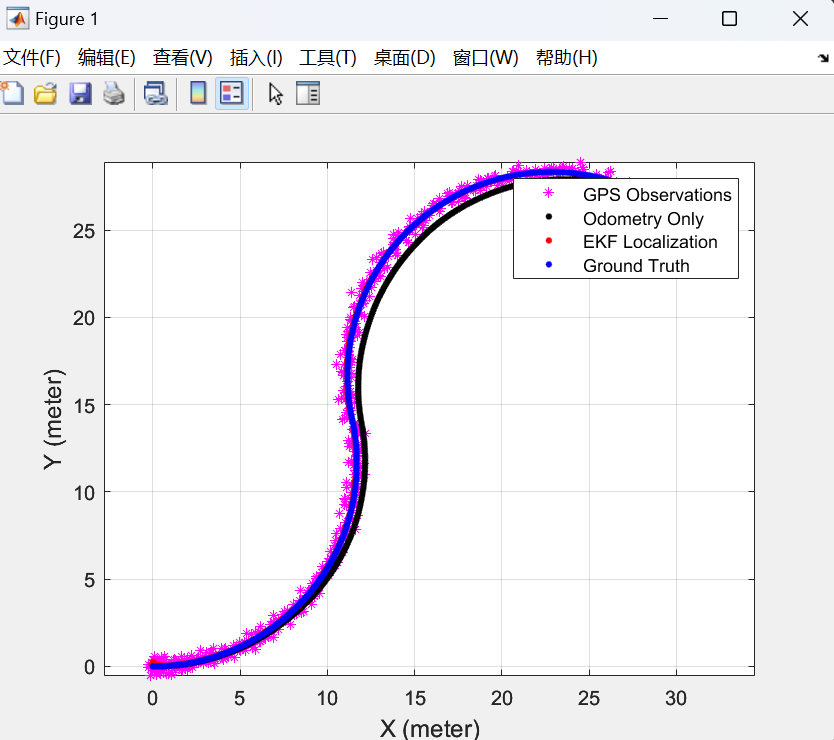
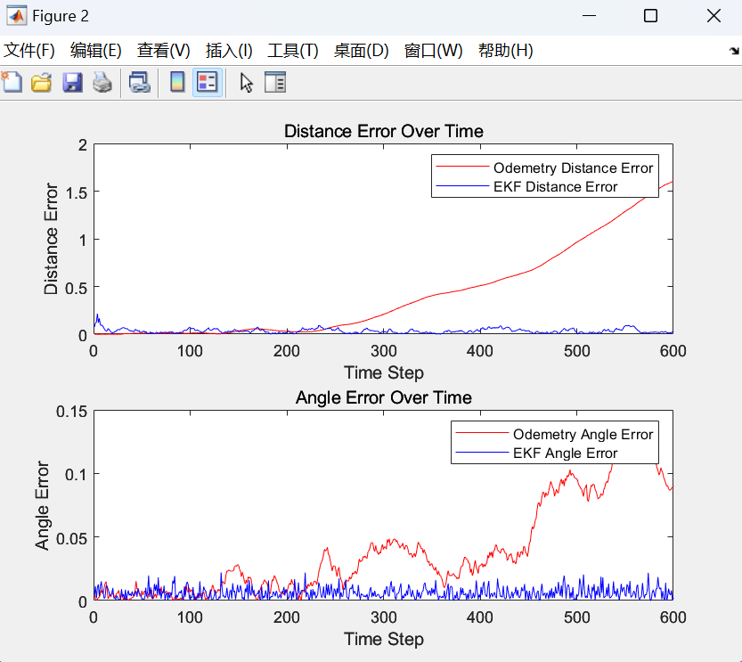

## <center> EKF 实验报告 </center>
### 实验要求及实现
**1. 计算协方差矩阵convR和convQ，以及其他EKF初始化**
- **实现过程：** 观察代码可以得知，观测模型的噪声为 noiseR * randn(3,1)，运动模型的噪声为noiseQ*randn(3,1)，对该噪声计算方差即可得到convR和convQ。初始的位置向量设置为[0 0 0]，协方差矩阵设置为单位矩阵。
$$
Var(noiseQ∗randn(3,1))=noiseQ⋅I_3
 ⋅noiseQ^T
$$
**代码实现如下：**
    ```matlab
        % Covariance Matrix for motion
        convQ = noiseQ.^2;

        % Covariance Matrix for observation
        convR = noiseR.^2;

        % Other Intial
        sigma_EKF = eye(3);
        miu_EKF = [0 0 0]';
    ```

**2. 运动模型doMotion()，以及雅各比矩阵jacobF()。输入为上一时刻位姿和速度角速度，以及时间间隔，输出为推算得到的当前位姿**
- **实现过程：** 运动方程采用如下的方法进行更新，雅可比矩阵按照对应公式求解即可(其中 $v = (v_x^2 + v_y^2)^{\frac{1}{2}}$)
$$
\begin{aligned}
       x_t &= x_{t-1} - \frac{v}{w}\sin\theta + \frac{v}{w}\sin(\theta + w\Delta t)\\
    y_t &= y_{t-1} - \frac{v}{w}\cos\theta + \frac{v}{w}\cos(\theta + w\Delta t)\\
    \theta_t &=   \theta_{t-1} + w\Delta t 
\end{aligned}
$$
**代码实现如下：**
    ```matlab
    function x = doMotion(x, u)
        global dt;
        v = sqrt(u(1)^2 + u(2)^2);
        x(1) = x(1) - v/u(3)*sin(x(3)) + v/u(3)*sin(x(3) + u(3)*dt);
        x(2) = x(2) + v/u(3)*cos(x(3)) - v/u(3)*cos(x(3) + u(3)*dt);
        x(3) = x(3) + u(3)*dt;
    end

    % Jacobian of Motion Model
    function jF = jacobF(x, u)
        global dt;
        v = sqrt(u(1)^2 + u(2)^2);
        jF = [1 0 -v/u(3)*cos(x(3)) + v/u(3)*cos(x(3) + u(3)*dt);
            0 1 -v/u(3)*sin(x(3)) + v/u(3)*sin(x(3) + u(3)*dt);
            0 0 1];
    end
    ```
**3. 观测模型doObservation()，以及雅各比矩阵jacobH()。输入为GPS观测和运动模型的预测位姿**
- **实现过程：** 由源代码的prepare函数可知，观测输出z=xTruth+noiseR*randn(3,1)，即观测模型中 $h(x) = x$，由此可以得出观测模型和雅各比矩阵
- **代码如下：**
    ```matlab
    %Observation Model
    function x = doObservation(z, xPred)
        x = xPred;
    end

    %Jacobian of Observation Model
    function jH = jacobH(x)
        jH = eye(3);
    end
    ```
**4. 在for循环中，实现拓展卡尔曼滤波的过程，输出Ekf位姿变量x**
- **实现过程：** 卡尔曼滤波的具体实现即为如下5个公式的不断迭代更新：
  $$
  \begin{aligned}
     \hat{x}_{k|k-1} &= f(\hat{x}_{k-1|k-1}, u_k) \\
     P_{k|k-1} & = F_k P_{k-1|k-1} F_k^T + Q_k  \\
     K_k &= P_{k|k-1} H_k^T (H_k P_{k|k-1} H_k^T + R_k)^{-1} \\
    \hat{x}_{k|k} &= \hat{x}_{k|k-1} + K_k (z_k - h(\hat{x}_{k|k-1}))\\
    P_{k|k} &= (I - K_k H_k) P_{k|k-1} \\
  \end{aligned}
  $$
- **具体代码如下：**
  ```matlab
        % ------ Kalman Filter --------
    % Predict
    miu_EKF_estimate = doMotion(miu_EKF, u);
    jF = jacobF(miu_EKF, u);
    sigma_estimate = jF * sigma_EKF * jF' + convQ;

    % Update Step
    zPred = doObservation(z, miu_EKF_estimate);
    jH = jacobH(miu_EKF_estimate);
    K = sigma_estimate * jH' / (jH * sigma_estimate * jH' + convR);
    miu_EKF = miu_EKF_estimate + K * (z - zPred);
    sigma_EKF = (eye(3) - K * jH) * sigma_estimate;


    % Update
    xEkf = miu_EKF;
   ```
**5. 在最后的finalPlot()函数中，根据定位真值，计算纯里程计误差，以及你的EKF定位误差，用disp()函数在控制台输出**
- **实现过程：** 分别计算每个时刻EKF和里程计与真值的距离误差和角度误差，累计得到总误差进行输出，并绘制误差随时间图像
- **具体代码如下：**
    ```matlab
    % 计算每个时间点的距离误差
    odemetry_distance_error = sqrt((estimation.xTruth(:,1) - estimation.xOdom(:,1)).^2 + (estimation.xTruth(:,2) - estimation.xOdom(:,2)).^2);
    EKF_distance_error = sqrt((estimation.xTruth(:,1) - estimation.xEkf(:,1)).^2 + (estimation.xTruth(:,2) - estimation.xEkf(:,2)).^2);
    
    disp('odemetry_distance_error:')
    disp(sum(odemetry_distance_error))
    disp('EKF_distance_error:')
    disp(sum(EKF_distance_error))

    % 绘制距离误差随时间的变化
    subplot(2, 1, 1);
    plot(odemetry_distance_error, '-r', 'DisplayName', 'Odemetry Distance Error');
    hold on;
    plot(EKF_distance_error, '-b', 'DisplayName', 'EKF Distance Error');
    xlabel('Time Step');
    ylabel('Distance Error');
    title('Distance Error Over Time');
    legend;
    hold off;

    % 计算每个时间点的角度误差
    odemetry_angle_error = abs(estimation.xTruth(:,3) - estimation.xOdom(:,3));
    EKF_angle_error = abs(estimation.xTruth(:,3) - estimation.xEkf(:,3));

    % 绘制角度误差随时间的变化
    subplot(2, 1, 2);
    plot(odemetry_angle_error, '-r', 'DisplayName', 'Odemetry Angle Error');
    hold on;
    plot(EKF_angle_error, '-b', 'DisplayName', 'EKF Angle Error');
    xlabel('Time Step');
    ylabel('Angle Error');
    title('Angle Error Over Time');
    legend;
    hold off;

    disp('odemetry_angle_error:')
    disp(sum(odemetry_angle_error))
    disp('EKF_angle_error:')
    disp(sum(EKF_angle_error))
    ```
### 实验结果
下图为EKF的结果和误差随时间的变化的图像
 <div style="display: flex; justify-content: space-around; align-items: center;">
  <div style="text-align: center;">
    
    <p><b></b></p>
  </div>
  <div style="text-align: center;">
    
    <p><b></b></p>
  </div>
</div>

```bash
>> ekf_localization
EKF Start!
odemetry_distance_error:
     2.487508066626656e+02


EKF_distance_error:
  20.089222466705600


odemetry_angle_error:
  23.199129123810277


EKF_angle_error:
   3.616390975358613
```
可以看出，由于EKF综合考虑了观测误差和运动模型误差，而纯里程估计只考虑了运动模型误差。EKF的误差比纯里程累积的误差小很多，且EKF的误差在很小的范围内波动，而纯里程累计的误差会不断增大

