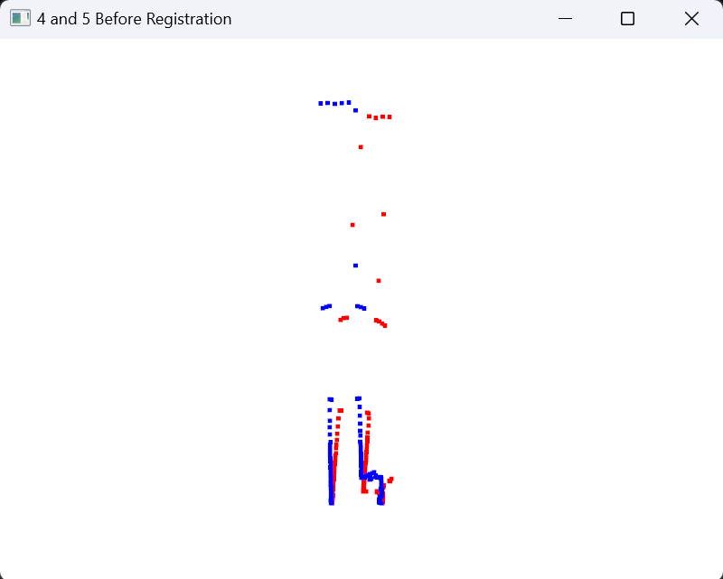
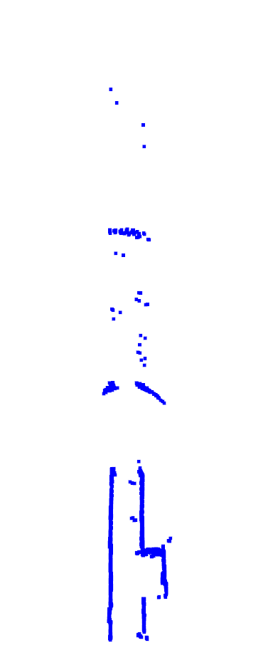

## <center>ICP里程估计报告
#### 实验语言与工具：
python 3.9.20 + open3d 0.15.1
#### 实验内容：
给定10帧移动机器人的二维激光点云，实现相邻之间的 ICP 点云匹配，进而航位推算得到机器人这10帧的轨迹，并进行局部点云地图合成
#### 解决思路：
- **ICP算法（Point to Point）：**
  ICP算法的核心思想是通过迭代的方式，不断优化两个点云之间的对应关系，使得变换后两个点云之间的距离最小化。具体步骤如下：
    1. 选择初始变换矩阵$T$，将源点云$P$变换到目标点云$Q$的坐标系下。
    2. 通过最近点对应找到两个点云之间的对应关系。
    3. 通过最小二乘法求解最优变换矩阵$T$。
    4. 重复2-3步直到达到最大迭代上限或满足误差限。
    5. 得到最终的变换矩阵$T$。
    6. 将源点云$P$通过变换矩阵$T$变换到目标点云$Q$的坐标系下。
   
    其中，核心步骤通过最小二乘法求解最优变换矩阵的具体步骤如下：

    **1.计算质心**

    计算源点云 \( S \) 和目标点云 \( T \) 的质心：

    \[
    \bar{s} = \frac{1}{n} \sum_{i=1}^{n} s_i
    \]

    \[
    \bar{t} = \frac{1}{n} \sum_{i=1}^{n} t_i
    \]

    其中 \( \bar{s} \) 和 \( \bar{t} \) 分别是源点云和目标点云的质心，\( n \) 是点的数量。

    **2.去中心化点云**

    将源点云和目标点云去中心化：

    \[
    s'_i = s_i - \bar{s}
    \]

    \[
    t'_i = t_i - \bar{t}
    \]

    **3. 构建协方差矩阵**

    构建协方差矩阵 \( H \)：

    \[
    H = \sum_{i=1}^{n} s'_i (t'_i)^T
    \]

    **4. 奇异值分解 (SVD)**

    对协方差矩阵 \( H \) 进行奇异值分解：

    \[
    H = U S V^T
    \]

    其中：
    - \( U \) 和 \( V \) 是正交矩阵。
    - \( S \) 是对角矩阵，包含了 \( H \) 的奇异值。

    **5. 计算旋转矩阵**

    计算旋转矩阵 \( R \)：

    \[
    R = V U^T
    \]

    **6. 计算平移向量**

    计算平移向量 \( t \)：

    \[
    t = \bar{t} - R \bar{s}
    \]
 **具体代码实现如下：**
    ```python
    def compute_transformation(source, target):
        """计算点云之间的变换矩阵"""
        # 计算中心坐标
        centroid_source = np.mean(source, axis=0)
        centroid_target = np.mean(target, axis=0)

        # 去中心化
        source_centered = source - centroid_source
        target_centered = target - centroid_target

        # 计算协方差矩阵
        covariance_matrix = np.dot(source_centered.T, target_centered)

        # SVD分解
        U, _, Vt = np.linalg.svd(covariance_matrix)

        # 计算旋转矩阵
        rotation = np.dot(Vt.T, U.T)

        # 计算平移向量
        translation = centroid_target - np.dot(rotation, centroid_source)

        # 构造变换矩阵
        transformation = np.eye(3)
        transformation[:2, :2] = rotation
        transformation[:2, 2] = translation[:2]
        return transformation
    ```
<br>

- **匹配与地图构建：** 基本思路为将1-9帧的点云逐一与融合点云（初始为第0帧点云）进行ICP匹配，得到相对于世界坐标系的变换矩阵，然后将每一帧的点云通过变换矩阵变换到第0帧的坐标系下，与当前融合点云融合得到新的融合点云，9张图都融合后得到的融合点云即为三维点云地图

    然而实际操作时由于后几帧与第0帧的距离、形状差异较大，导致ICP匹配效果不佳，因此在实际操作中，我选择了将融合点云变换到当前帧前一帧的坐标系下(不选择当前帧是因为要额外做当前帧和前一帧的ICP匹配获取变换矩阵），然后与当前帧进行ICP匹配，得到相对于前一帧的变换矩阵，再将当前帧变换到融合点云坐标系下，与融合点云进行融合
**具体代码如下：**
    ```python
    # 读取当前点云
    for i in range(1, 10):

        # 读取当前点云
        curr_ply = load_point_cloud(f'{i}.ply')
        curr_points = np.asarray(curr_ply.points)[:, :2]  # 只保留 x 和 y 坐标
        
        tform = np.dot(tform_real,tform)

        # 为了当前帧和第0帧匹配的准确性，需要将当前帧的点云做一些变换（本质相当于将第0帧融合后的点云变换到i-1帧坐标系下）
        curr_points = np.dot(tform[:2, :2], curr_points.T).T + tform[:2, 2]


        # ICP算法进行当前点云和第0帧点云的配准
        tform_real = icp.icp(curr_points, laser_map_points)

        # 记录机器人相对于世界坐标系的位姿
        transform_all.append(tform)
        # 记录机器人不同帧的位置
        trajectory_points.append(tform[:2, 2])  

        # 将当前帧点云变换到世界坐标系下
        transformed_points = np.dot(tform_real[:2, :2], curr_points.T).T + tform_real[:2, 2]

        # 合并点云
        laser_map_points = merge_point_clouds(laser_map_points, transformed_points, 0.01)
    ```
- **三维地图和机器人轨迹可视化：** 使用open3d库将融合后的点云和机器人每一帧的位置可视化，代码如下：
    ```python
        # 将合并后的点云转换为三维格式
        laser_map_points_3d = np.hstack((laser_map_points, np.zeros((laser_map_points.shape[0], 1))))

        # 创建Open3D点云对象
        
        laser_map_pcd = o3d.geometry.PointCloud()
        laser_map_pcd.points = o3d.utility.Vector3dVector(laser_map_points_3d)
        laser_map_pcd.paint_uniform_color([0, 0, 1])  # 蓝色表示地图
        # 显示合并后的点云
        o3d.visualization.draw_geometries([laser_map_pcd])

        # 轨迹点
        trajectory_points_3d = np.array([[x, y, 0] for x, y in trajectory_points])

        # 创建轨迹点云对象
        trajectory_pcd = o3d.geometry.PointCloud()
        trajectory_pcd.points = o3d.utility.Vector3dVector(trajectory_points_3d)
        trajectory_pcd.paint_uniform_color([1, 0, 0])  # 红色表示轨迹点

        # 创建 LineSet 对象以连接轨迹点
        lines = [[i, i + 1] for i in range(len(trajectory_points_3d) - 1)]
        colors = [[1, 0, 0] for _ in range(len(lines))]  # 红色表示轨迹线条

        # 创建 LineSet，并设置点和线条
        line_set = o3d.geometry.LineSet()
        line_set.points = o3d.utility.Vector3dVector(trajectory_points_3d)
        line_set.lines = o3d.utility.Vector2iVector(lines)
        line_set.colors = o3d.utility.Vector3dVector(colors)

        # 显示轨迹点云和连线以及地图
        o3d.visualization.draw_geometries([laser_map_pcd, trajectory_pcd, line_set], window_name="Point Cloud with Connected Trajectory")
    ```
<br>

#### 实验结果与分析：
icp_every.py实现了每两帧之间的ICP匹配，icp_maping.py实现了每一帧与第0帧的ICP匹配和三维地图构建，下面展示了每两帧之间的ICP匹配结果和最终的三维地图和机器人轨迹可视化结果：
0 & 1 帧ICP匹配结果：
<div style="display: flex; justify-content: space-around; align-items: center;">
  <div style="text-align: center;">
    
    <p><b>匹配前</b></p>
  </div>
  <div style="text-align: center;">
    
    <p><b>匹配后</b></p>
  </div>
</div>
1 & 2 帧ICP匹配结果：
<div style="display: flex; justify-content: space-around; align-items: center;">
  <div style="text-align: center;">
    
    <p><b>匹配前</b></p>
  </div>
  <div style="text-align: center;">
    
    <p><b>匹配后</b></p>
  </div>
</div>
2 & 3 帧ICP匹配结果：
<div style="display: flex; justify-content: space-around; align-items: center;">
  <div style="text-align: center;">
    
    <p><b>匹配前</b></p>
  </div>
  <div style="text-align: center;">
    
    <p><b>匹配后</b></p>
  </div>
</div>
3 & 4 帧ICP匹配结果：
<div style="display: flex; justify-content: space-around; align-items: center;">
  <div style="text-align: center;">
    
    <p><b>匹配前</b></p>
  </div>
  <div style="text-align: center;">
    
    <p><b>匹配后</b></p>
  </div>
</div>
4 & 5 帧ICP匹配结果：
<div style="display: flex; justify-content: space-around; align-items: center;">
  <div style="text-align: center;">
    
    <p><b>匹配前</b></p>
  </div>
  <div style="text-align: center;">
    
    <p><b>匹配后</b></p>
  </div>
</div>
5 & 6 帧ICP匹配结果：
<div style="display: flex; justify-content: space-around; align-items: center;">
  <div style="text-align: center;">
    
    <p><b>匹配前</b></p>
  </div>
  <div style="text-align: center;">
    
    <p><b>匹配后</b></p>
  </div>
</div>
6 & 7 帧ICP匹配结果：
<div style="display: flex; justify-content: space-around; align-items: center;">
  <div style="text-align: center;">
    
    <p><b>匹配前</b></p>
  </div>
  <div style="text-align: center;">
    
    <p><b>匹配后</b></p>
  </div>
</div>
7 & 8 帧ICP匹配结果：
<div style="display: flex; justify-content: space-around; align-items: center;">
  <div style="text-align: center;">
    
    <p><b>匹配前</b></p>
  </div>
  <div style="text-align: center;">
    
    <p><b>匹配后</b></p>
  </div>
</div>
8 & 9 帧ICP匹配结果：
<div style="display: flex; justify-content: space-around; align-items: center;">
  <div style="text-align: center;">
    
    <p><b>匹配前</b></p>
  </div>
  <div style="text-align: center;">
    
    <p><b>匹配后</b></p>
  </div>
</div>
可以看出，每两帧之间经过ICP匹配与矩阵变换后，点云之间的重合度较高，匹配效果较好。

**最终的三维地图可视化结果如下：**

<div style="display: flex; justify-content: space-around; align-items: center;">
  <div style="text-align: center;">
    
    <p><b></b></p>
  </div>
  <div style="text-align: center;">
    
    <p><b></b></p>
  </div>
</div>
可以看出，最终的三维地图和matlab示例程序的几乎完全一致，说明三维地图构建效果较好

在三维地图中加入机器人轨迹的可视化结果如下：
   <div align = "center">
   <p align="center"><b> </b> </p >
   
   </div>
每一帧机器人的位姿如下：

```bash
第0帧位姿： [[1. 0. 0.]
 [0. 1. 0.]
 [0. 0. 1.]]
第1帧位姿： [[ 0.99949607  0.03174295  0.0459112 ]
 [-0.03174295  0.99949607  1.10817193]
 [ 0.          0.          1.        ]]
第2帧位姿： [[ 0.99493393  0.10053099  0.19234955]
 [-0.10053099  0.99493393  2.20681541]
 [ 0.          0.          1.        ]]
第3帧位姿： [[ 0.98860002  0.1505656   0.3374278 ]
 [-0.1505656   0.98860002  3.30991468]
 [ 0.          0.          1.        ]]
第4帧位姿： [[ 0.99967764  0.02538947  0.40212563]
 [-0.02538947  0.99967764  3.96133597]
 [ 0.          0.          1.        ]]
第5帧位姿： [[ 0.99808826 -0.06180468  0.316723  ]
 [ 0.06180468  0.99808826  5.01154778]
 [ 0.          0.          1.        ]]
第6帧位姿： [[ 0.99819743 -0.06001574  0.28151967]
 [ 0.06001574  0.99819743  5.92344906]
 [ 0.          0.          1.        ]]
第7帧位姿： [[ 9.99981138e-01  6.14197468e-03  1.32409391e-01]
 [-6.14197468e-03  9.99981138e-01  6.71884754e+00]
 [ 0.00000000e+00  0.00000000e+00  1.00000000e+00]]
第8帧位姿： [[ 0.99797427  0.06361881  0.16634884]
 [-0.06361881  0.99797427  8.02356285]
 [ 0.          0.          1.        ]]
第9帧位姿： [[ 0.99809784  0.0616499   0.16716786]
 [-0.0616499   0.99809784  8.95220056]
 [ 0.          0.          1.        ]]
 ```

 利用matlabicp库函数得到的位姿标准值为：
 ```bash
 第0帧位姿： [[1. 0. 0.]
 [0. 1. 0.]
 [0. 0. 1.]]
第1帧位姿：
 [[0.999501992567111	0.0315557737090073	0	0.0484478358774631
-0.0315557737090073	0.999501992567111	0	1.10032796286276
0	0	1	0
0	0	0	1 ]]
第2帧位姿： 
[0.994950731679136	0.100364543197050	0	0.194321542940282
-0.100364543197050	0.994950731679136	0	2.20003560179805
0	0	1	0
0	0	0	1]
第3帧位姿：
 [0.988634918790660	0.150336280876526	0	0.339196807881677
-0.150336280876526	0.988634918790660	0	3.30480823978887
0	0	1	0
0	0	0	1 ]
第4帧位姿：
 [ 0.999680269074776	0.0252855615437780	0	0.403235934705006
-0.0252855615437780	0.999680269074776	0	3.93740489789226
0	0	1	0
0	0	0	1 ]
第5帧位姿： 
[0.998084059247189	-0.0618725357218760	0	0.318579887107009
0.0618725357218760	0.998084059247189	0	4.98130940130177
0	0	1	0
0	0	0	1]
第6帧位姿：
 [0.998208499667106	-0.0598313562636258	0	0.280535032236613
0.0598313562636258	0.998208499667106	0	5.86298602376809
0	0	1	0
0	0	0	1]
第7帧位姿：
 [0.999985518974393	0.00538162071442959	0	0.135103123836695
-0.00538162071442959	0.999985518974393	0	6.63397402554013
0	0	1	0
0	0	0	1]
第8帧位姿： 
[0.997958007813105	0.0638734267258207	0	0.165360183643975
-0.0638734267258207	0.997958007813105	0	7.94292516195134
0	0	1	0
0	0	0	1]
第9帧位姿： 
[0.998127776286514	0.0611632422729395	0	0.165582787812991
-0.0611632422729395	0.998127776286514	0	8.87327565613801
0	0	1	0
0	0	0	1]
```
**计算每一帧的位置相对误差和旋转相对误差可得：**
**平移分量相对误差（逐帧）**
| 帧数 | x 方向误差 | y 方向误差 | z 方向误差 |
| ---- | ---------- | ---------- | ---------- |
| 0    | 0.0000     | 0.0000     | 0.0000     |
| 1    | 0.0524     | 0.0071     | 0.0000     |
| 2    | 0.0101     | 0.0031     | 0.0000     |
| 3    | 0.0052     | 0.0015     | 0.0000     |
| 4    | 0.0028     | 0.0061     | 0.0000     |
| 5    | 0.0058     | 0.0061     | 0.0000     |
| 6    | 0.0035     | 0.0103     | 0.0000     |
| 7    | 0.0199     | 0.0128     | 0.0000     |
| 8    | 0.0060     | 0.0102     | 0.0000     |
| 9    | 0.0096     | 0.0089     | 0.0000     |

**旋转分量相对误差（逐帧）**（旋转分量误差计算时计算Frobenius范数的相对误差，即矩阵所有元素平方和的平方根）
| 帧数 | 旋转误差 |
| ---- | -------- |
| 0    | 0.0000   |
| 1    | 0.00019  |
| 2    | 0.00017  |
| 3    | 0.00023  |
| 4    | 0.00010  |
| 5    | 0.000068 |
| 6    | 0.00018  |
| 7    | 0.00076  |
| 8    | 0.00026  |
| 9    | 0.00049  |


